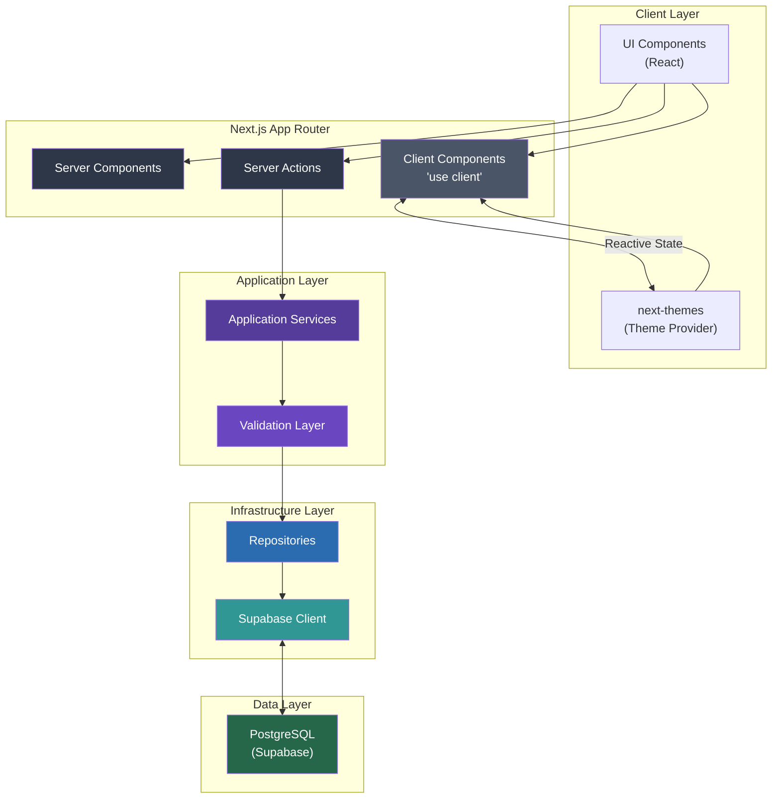

# Inventario Cocina

> Kitchen inventory management system. Track items across locations with stock levels, categories, and full-text search.

[](https://nextjs.org)
[](https://www.typescriptlang.org)
[](https://supabase.com)
[]()

Manage your kitchen supplies across every cabinet, shelf, and drawer. Built with Next.js 16, Supabase, Tailwind CSS 4, and TypeScript.

---

## Features

| Feature | Description |
|---|---|
| **Inventory Tracking** | Track stock levels, minimum thresholds, and units for every item |
| **Smart Locations** | Hierarchical locations (section → level → side → position) |
| **Category System** | Color-coded categories with full CRUD |
| **Full-Text Search** | Spanish-language search across item names and notes |
| **Stock Alerts** | Visual indicators for low/empty stock |
| **Quick Stock Update** | Increment/decrement stock directly from the list |
| **Export** | Download inventory as Markdown grouped by location |
| **Dark Mode** | System-aware theming with manual toggle |
| **Mobile-First** | Bottom navigation on mobile, responsive throughout |

---

## Tech Stack

| Component | Technology |
|---|---|
| **Framework** | Next.js 16.2.4 (App Router) |
| **Language** | TypeScript 5 |
| **Styling** | Tailwind CSS 4 + shadcn/ui (oklch colors) |
| **Backend** | Supabase (PostgreSQL + SSR) |
| **Icons** | Lucide React |
| **Notifications** | Sonner |
| **State Management** | Server Actions + React State |
| **Theme** | next-themes (cookie-based) |

---

## Architecture



### Folder Structure

```
src/
├── app/                    # Next.js pages (App Router)
├── components/ui/          # shadcn/ui base components
├── features/               # Feature modules (Clean Architecture)
│   ├── inventory/
│   ├── categories/
│   └── locations/
└── lib/                    # Shared utilities
    ├── actions/            # Server Actions
    ├── supabase/           # DB clients
    └── utils.ts
```

For detailed architecture documentation, database schema, and implementation notes, refer to the project documentation files.

---

## Database

Three core tables: `categories`, `locations`, `inventory_items`

- `locations.full_path` — auto-generated (stored) from section/side/position/level
- `inventory_items.search_vector` — full-text search (Spanish, weighted)
- Row Level Security enabled (fully permissive for personal use)
- Soft deletes via `is_active` flag

For the full ERD and database schema details, refer to the project documentation.

---

## Getting Started

```bash
# Install dependencies
npm install

# Set up environment variables
cp .env.example .env.local
# Add NEXT_PUBLIC_SUPABASE_URL and NEXT_PUBLIC_SUPABASE_PUBLISHABLE_KEY

# Run the development server
npm run dev

# Build for production
npm run build

# Lint code
npm run lint
```

**Requirements:** Node.js 20+, a Supabase project (PostgreSQL)

**Database setup:** Run `supabase/setup_database.sql` in your Supabase SQL editor.

---

## Project Conventions

| Convention | Rule |
|---|---|
| Language | Spanish (es) for all UI text |
| State | Single object for cascading dropdown selections |
| Mutations | Always return `{ success, data?, error? }` |
| Validation | Dual (UI form + service layer) |
| Components | Server Components preferred; `'use client'` only when needed |
| Theme | Cookie-based (not localStorage) for SSR compatibility |

---

## Routes

| Path | Description |
|---|---|
| `/inventory` | Item list with search, filters, and stock quick-update |
| `/inventory/new` | Create new inventory item |
| `/inventory/[id]` | Item detail view |
| `/inventory/[id]?edit=true` | Edit existing item |
| `/categories` | Category grid |
| `/categories/new` | Create category |
| `/locations` | Location tree (grouped by section) |
| `/locations/new` | Create location |

---

## License

Private — personal project.